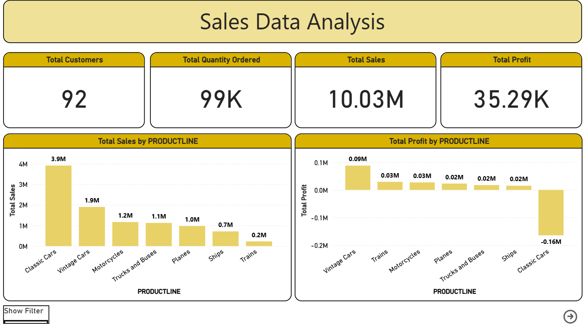
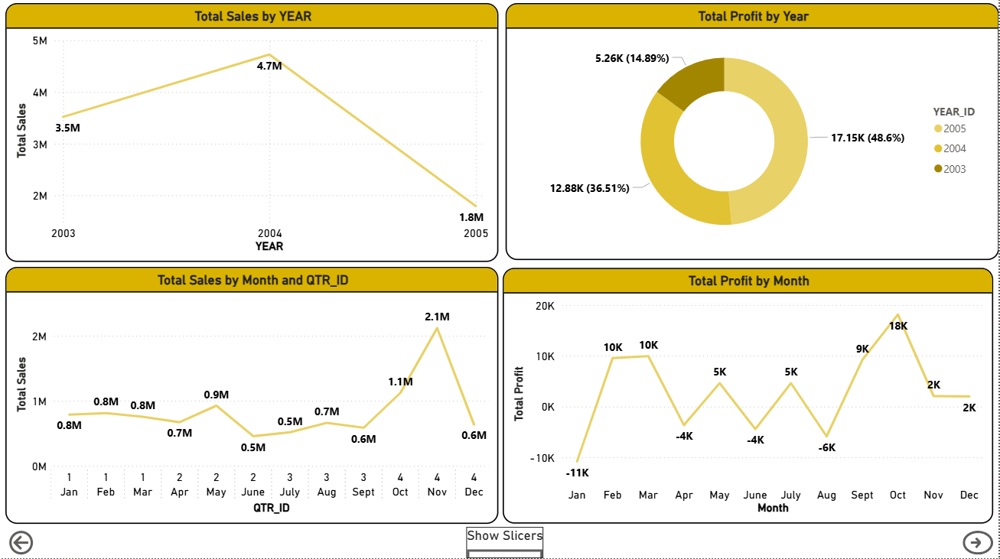
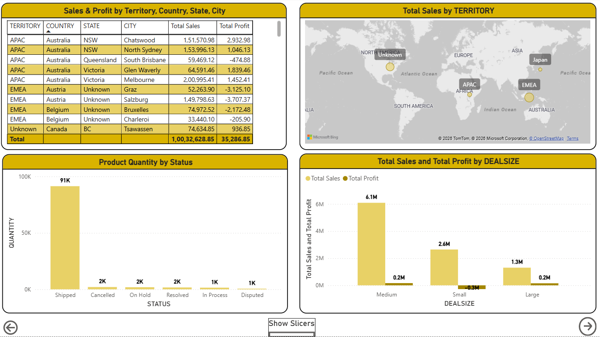
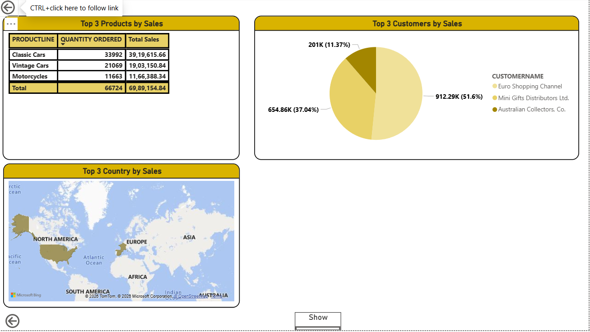

📊 Sales Analysis Dashboard (Power BI)
Overview

This project is an interactive Sales Analysis Dashboard developed in Microsoft Power BI to analyze sales performance, customer behavior, product trends, and geographical sales distribution.

The dashboard provides actionable insights through multiple report pages, enabling users to monitor key business metrics and make data-driven decisions.

🚀 Features
1. Overview Dashboard
* High-level sales performance summary
* KPI Cards for important business metrics
* Sales comparison through column charts
* Interactive slicers for filtering data
* Navigation buttons for easy page switching
2. Timely Analysis
* Sales trends over time using line charts
* Time-based performance analysis
* Category-wise contribution using donut charts
* Dynamic filtering options
3. Country-wise Analysis
* Geographical sales distribution
* Country-level sales comparison
* Interactive maps and charts
* Detailed sales tables for regional insights
4. Top Products & Customers
* Identification of top-performing products
* Customer contribution analysis
* Product and customer ranking visuals
* Geographical representation of key customers
  
📈 Key Insights
* Track overall sales performance.
* Analyze sales trends across different time periods.
* Identify top-performing products and customers.
* Compare sales across countries and regions.
* Filter reports dynamically for deeper analysis.
  
🛠️ Tools & Technologies
* Microsoft Power BI
* DAX (Data Analysis Expressions)
* Power Query
* Interactive Visualizations
* Dashboard Pages
  
### Page	Description
* Overview	Business KPIs and sales summary
* Timely Analysis	Time-series sales analysis
* Country-wise Analysis	Geographic sales performance
* Top Products & Customers	Product and customer insights

📂 Project Structure
* Sales Analysis Dashboard.pbix
* README.md

## 📸 Dashboard Preview

### Overview

### Timely Analysis

### Country-wise Analysis

### Top Products & Customers

🎯 Business Value
* This dashboard helps stakeholders:
* Monitor sales performance efficiently.
* Identify growth opportunities.
* Understand customer purchasing behavior.
* Evaluate product performance.

Author
Ansar Inamdar
